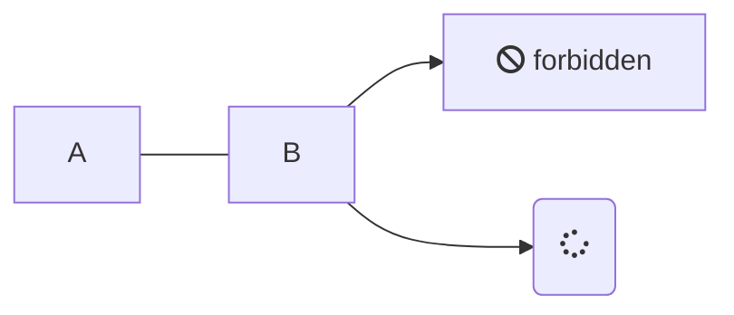
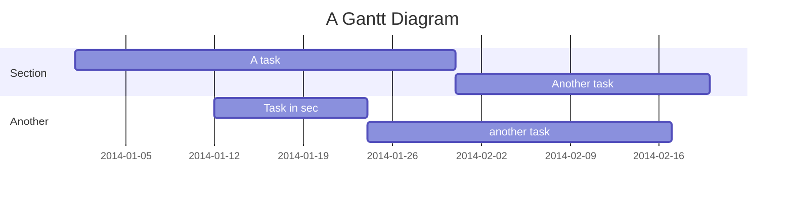

# Features

## Markdown Features

DocSPA uses [remark](https://remark.js.org/) for markdown rendering.

### Github Flavored Markdown

```markdown { playground }
- [ ] foo
- [x] baz
- [ ] bim
- [ ] lim

| Tables        | Are           | Cool  |
| ------------- |:-------------:| -----:|
| col 3 is      | right-aligned | $1600 |
| col 2 is      | centered      |   $12 |
| zebra stripes | are neat      |    $1 |
```

i> See full suite of [markdown here](markdown)

### HTML in Markdown

DocSPA (via remark) supports HTML directly in markdown:

```html { playground }
Acronyms: <abbr title="Three Letter Acronym">TLA</abbr>

<div align="center">
  <iframe
    width="620"
    height="315"
    src="https://www.youtube.com/embed/dQw4w9WgXcQ">
  </iframe>
</div>

<iframe src="https://embed.plnkr.co/plunk/2eQ9jheOTm8i74vp2EmP?autoCloseSidebar&deferRun&show=preview"
  style="width: 100%; height: 400px;"
  allowfullscreen
  scrolling="no"></iframe>
```

## Markdown Extensions

DocSPA supports [remark plugins](https://github.com/remarkjs/remark/blob/master/doc/plugins.md#list-of-plugins).  Several plugins are activated by default.

i> Additional plugins can be added in the `docspa.config.ts` configuration file.

### Blocks

<small>using [remark-custom-blocks](https://github.com/zestedesavoir/zmarkdown/tree/master/packages/remark-custom-blocks)</small>

```markdown { playground }
[[note | Note]]
| This is a note

[[info | Information]]
| _TODO:_
| unit test

[[tip | *Tip*]]
| *Time* is money,
| my friend!

[[warning | **Watch Out!**]]
| A warning

[[figure | **Figure 1: Figure Title**]]
| 

[[caption | **Table 1: Table Title**]]
| | Tables        | Are           | Cool  |
| | ------------- |:-------------:| -----:|
| | col 3 is      | right-aligned | $1600 |
| | col 2 is      | centered      |   $12 |
| | zebra stripes | are neat      |    $1 |
```

i> The styles of these elements can be customized using CSS.

i> Additional custom blocks can be added in the `docspa.config.ts` configuration file.

### Notices

<small>using [remark-custom-blockquotes](https://github.com/montogeek/remark-custom-blockquotes)</small>

```markdown { playground }
> This is a normal blockquote,
> nothing to see here!

i> _TODO:_
i> unit test

!> *Time* is money,
!> my friend!

?> **Watch Out!** A warning
```

i> The styles of these elements can be customized using CSS.

i> Additional custom NOTICES can be added in the `docspa.config.ts` configuration file.

### Code highlight

```js
(function () {
  console.log('Hello');
})();
```

```html
<b>hello</b>
```

```markdown
*Hello*
```

~~~markdown { playground }
Line highlights:

```javascript { line="13-27"}
const config = {
  name: 'DocSPA',
  basePath: 'docs/',
  loadNavbar: '_navbar.md',
  loadSidebar: '_sidebar.md',
  homepage: 'README.md',
  coverpage: '_coverpage.md',
  plugins: [
    mermaidHook,
    footer
  ],
  remarkPlugins: [
    frontmatter,
    parseFrontmatter,
    readMatter,
    infoString,
    customBlockquotes,
    slug,
    [ headings, { behaviour: 'wrap' } ],
    math,
    katex,
    gemojiToEmoji,
    [htmlEmojiImage, { base: 'https://assets-cdn.github.com/images/icons/emoji/' }],
    [remarkAttr, { scope: 'permissive' }],
    infoStringToAttr,
    customBlocks,
    runtime
  ],
  runtimeModules: [
    CommonModule,
    NgxChartsModule,
    BrowserAnimationsModule
  ]
};
```
~~~

### Mermaid

~~~markdown { playground }



~~~

### Math (Katex)

<small>using [remark-math](https://github.com/Rokt33r/remark-math)</small>

```markdown { playground }
$$
E^2=(mc^2)^2+(pc)^2
$$
```

### Emoji

<small>using [remark-gemoji-to-emoji](https://github.com/jackycute/remark-gemoji-to-emoji) and [remark-html-emoji-image](https://github.com/jackycute/remark-html-emoji-image)</small>

```markdown { playground }
:100: :8ball: :100:
```

## Markdown Styles

The default remark plugins include [remark-attr](https://github.com/arobase-che/remark-attr) which allows adding styles and classes to markdown elements.

### Style

```markdown { playground }
*Doc*{style="color:red; font-size: large"}*SPA*{style="color:blue"}

{ width="300px" style="border: 10px solid lightgrey; padding: 10px;"}
```

### Classes (Badges)

```html { playground }
<span class="badge note">note</span>
<span class="badge info">info</span>
<span class="badge tip" title="This is a tip">tip</span>
<span class="badge warn" title="Watch out!!">warn</span>
```

```markdown { playground }
`note`{ .badge .note }
*info*{ .badge .info }
**tip**{ .badge .tip title="This is a tip" }
**warn**{ .badge .warn title="Watch out!!" }
```

## Custom Elements

DocSPA supports custom elements (part of the [web components](https://developer.mozilla.org/en-US/docs/Web/Web_Components) suite of technologies).  Once a custom component is loaded they may be embedded directly into the markdown.

i> Custom elements can be defined using `window.customElements.define` or using [angular elements](https://angular.io/guide/elements).

### md-toc

```markdown { playground }
<md-toc path="features" max-depth="2"></md-toc>
```

### md-embed

```markdown { playground }
<md-embed path="embed"></md-embed>
```

### Environment Variables

The `env-var` component allows displaying variables defined in the `environment.ts` file.

~~~markdown { playground }
DocSPA version: <env-var var="version"></env-var>
~~~

!> `ng build ---prod` replaces `environment.ts` with `environment.prod.ts`.  The list of file replacements can be found in `angular.json`.

### Runtime Content

A `runtime-content` component allows embedding Angular template content into the markdown.

The run time component can be added as HTML into the markdown file:

```markdown { playground }
<runtime-content context='{ "name": "World" }'>
Hello, {{name}}.
</runtime-content>
```

Or by adding `{ run }` in the fenced code language line:

~~~markdown { playground }
```html { run }
<button (click)="count = !count ? 1 : count + 1">Click me: {{count || 0}}</button>
```
~~~

Use `{ playground }` to create a section containing both the code and the runtime result:

```html { playground }
<div style="width: 100%; height: 200px">
  <ngx-charts-bar-vertical
      [legend]="true"
      [xAxis]="true"
      [yAxis]="true"
      [results]="[
        {
          'name': 'Germany',
          'value': 8940000
        },
        {
          'name': 'USA',
          'value': 5000000
        },
        {
          'name': 'France',
          'value': 7200000
        }
      ]">
  </ngx-charts-bar-vertical>
</div>
```

i> The components available within a runtime element are controlled by the `runtimeModules` array in the `docspa.config.ts` configuration file.

### Embedded Stackblitz

The `embed-stackblitz` component may be used to embed StackBlitz projects within documentation.

The `embed-stackblitz` component accepts a [StackBlitz project payload](https://stackblitz.com/docs#project-payload) as the `project` input.

```markdown { playground }
<embed-stackblitz
  title='Embeded StackBlitz Project<br />DocSPA'
  project='{"template": "javascript", "files": {"index.js": "console.log(123)", "index.html": "Hello World"} }'>
</embed-stackblitz>
```

or a path to a project payload in the documentation local files:

```markdown { playground }
<embed-stackblitz
  title='Local StackBlitz Project<br />DocSPA'
  project-path="examples/folder/stackblitz">
</embed-stackblitz>
```

?> When providing a payload path, if the `files` property contains an array, it is assumed that this is an array of relative paths from which the file content will be loaded.

You may also supply a `project-id` to to load an existing StackBlitz project:

```markdown { playground }
<embed-stackblitz
  title='Existing StackBlitz Project<br />DocSPA'
  project-id="sdk-create-project">
</embed-stackblitz>
```

If a both `project-id` and either a `project-path` or `project` input are provided, the files listed in the local project's files are treated as a a patch to the existing StackBlitz project.

```markdown { playground }
<embed-stackblitz
  title='Existing StackBlitz Project with local changes<br />DocSPA'
  project-id="sdk-create-project"
  project-path="examples/folder/stackblitz">
</embed-stackblitz>
```

## docsify plugins

DocSPA supports many docsify plugins

!> Not all docsify plugins are supported and in general it is preferred to use remark plugins or custom elements.

### zoom-image

<small>using `//unpkg.com/docsify/lib/plugins/zoom-image.min.js`</small>

```markdown { playground }

```

?> Add the `data-no-zoom` attribute to exclude an image `{ data-no-zoom="true" }`

### Copy code

<small>using [docsify-copy-code](https://github.com/jperasmus/docsify-copy-code)</small>

~~~markdown { playground }
```
<script src="//unpkg.com/docsify-copy-code"></script>
```
~~~

### Edit on github

<small>using [docsify-edit-on-github](https://github.com/njleonzhang/docsify-edit-on-github)</small>


